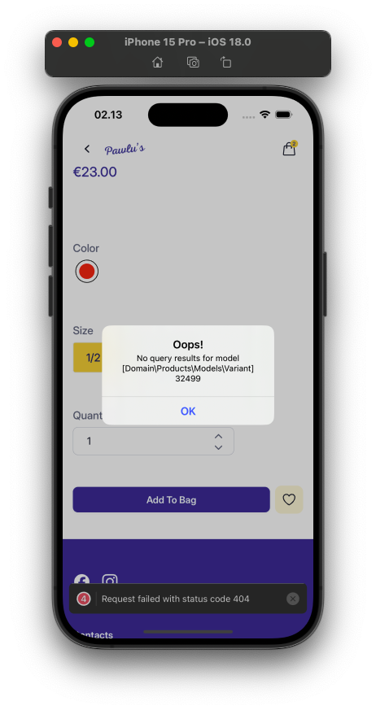
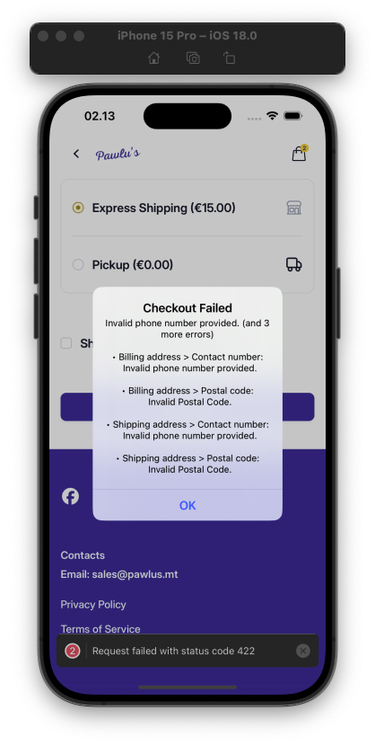
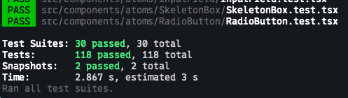

# Pawlu App

Pawlu is a mobile e-commerce application built with **React Native** and **Expo**. It allows users to browse products, add them to a cart, and complete a checkout process, providing a seamless shopping experience on both iOS and Android.

---

### iOS Demo

[▶️ Watch iOS Demo](demo/pawlu-ios-demo.mov)

### Android Demo

[▶️ Watch Android Demo](demo/pawlu-android-demo.mov)

### Storybook Demo

[▶️ Watch Storybook Demo](demo/storybook-demo.mov)


### Tech Stack

- **Expo**
- **Expo Router**
- **TypeScript**
- **Storybook** (for managing and previewing components)
- **Zustand** (for global state management)
- **React Query** (for API requests and caching)
- **React Native Reanimated** (for animations)
- **AsyncStorage** (to persist local data)
- **Jest** 
- **React Native Testing Library**

---

## Bonus Features

This application includes several advanced features that improve scalability, maintainability, and user experience:

### Atomic Design Architecture

- The project follows the **Atomic Design Pattern**, where components are split into Atoms, Molecules, Organisms, etc.
- Logic and UI are separated clearly, making the codebase easier to manage and maintain in the long run.

### Splash Screen & App Icon

- A customized **splash screen** and **app icon** are implemented for both Android and iOS platforms.
- The splash screen performs initial actions behind the scenes, creating a **seamless loading experience** for the user.

### Smart Caching Mechanism

- The app includes a **built-in caching strategy**. For example:
  - If a user visits a product page and later revisits it, the product details load instantly without refetching.
- This improves performance significantly and reduces redundant API calls.

### Home Screen Image Optimization

- On the home screen, product images are displayed using the **smallest available image sizes** (retrieved from the API) for **faster loading times**.
- However, on the **product details** page, the app uses **higher-resolution images** to ensure clarity and better user experience.

### Error Handling

- Errors are handled gracefully and displayed in a **user-friendly** manner, preventing crashes or confusing feedback.

Example: Backend Down Error



Example: API Error Alert



### Keyboard Handling

- Keyboard interactions are handled using `react-native-keyboard-controller`, ensuring a smooth experience especially in input-heavy screens.

### Performance Optimization

- Data-heavy computations are **memoized using `useMemo`** to avoid unnecessary recalculations, ensuring better performance across the app.

## Testing

This project is fully tested using the following tools:

- **[Jest](https://jestjs.io/)** 
- **[React Native Testing Library](https://callstack.github.io/react-native-testing-library/)** 
- Writing unit tests for all components and screens.
- Mocking native modules and APIs as needed for consistent test results.

To run the test suite:
```bash
npm run test
```



---

## CI/CD with Expo EAS

### Builds & Deployment

- This project supports **CI/CD via Expo Application Services (EAS)** for easier build and release workflows.
- For iOS, the app can be deployed to TestFlight using:

  ```bash
  npx testflight
  ```
- For Android, To build an Android app bundle (AAB)   for production:
  ```bash
  eas build -p android
  ```
  we can automate Android publishing using:
  ```bash
  eas submit -p android
  ```

Ensure that App Store Connect and Play Store & Play Store credentials are properly set up beforehand.

### Secure Environment Variables
- Sensitive configuration (ex: API keys) are stored securely using EAS environment variables.

- These variables are accessed via app.config.ts and used through expo-constants in the app.

- This prevents hardcoding secrets and helps avoid reverse-engineering risks.

### Core Features & Implementations

#### Product Listing
- Fetches and displays products from the API.
- Includes loading placeholders using skeleton loaders.
- API responses are cached for better performance.
- Fully supports both Android and iOS platforms.

#### Product Details
- Displays product information, images, variants/options.
- Users can select variant options and adjust quantity.
- Data is cached after first visit for quicker access (powered by React Query).
- Prevents re-fetching already visited products.
- Conditional rendering for unavailable fields (color/size/description).
- Validates stock availability if stock is `0`, user cannot add it to the cart.
- Integrated with the Add-to-Cart API and stays in sync with cart data.

#### Cart Management
- Shows all items in the cart, including selected variants and quantity.
- Allows quantity updates and item removal.
- UI updates immediately thanks to React Query.
- Handles empty cart state with proper conditional rendering.

#### Checkout Flow
- Collects billing details (name, address, etc.).
- Fetches and displays shipping options from the API.
- Updates total price based on selected shipping method.
- Submits the order (mocked without payment integration).
- Displays confirmation upon successful order placement.

#### Error Handling
- All API errors are captured and shown to users via friendly alerts.
- Error logic is centralized and made simple with React Query.

#### State Management
- Global state is managed using Zustand.
- Easy to persist, centralize, and access app-wide states such as the cart and shipping data.

---

### How to Run

#### 1. Install Dependencies

Ensure **Node.js** is installed, then run:

```bash
npm install
```

### 2. Prebuild the Project
To ensure all dependencies are set up:

```bash
npm run prebuild
```

### 3. Configure Environment Variables
Create a .env file at the root of your project with the following:

```bash
EXPO_PUBLIC_BASE_URL=https://pawlus.twinepos.dev/api/online/v1/
STORYBOOK_MODE=false

```

To enable Storybook mode, change `STORYBOOK_MODE` to `true`.

4. Run the App
To start on iOS:

```
npm run ios
```

To start on Android:
```
npm run android
```

### Created by Pasquale Palena